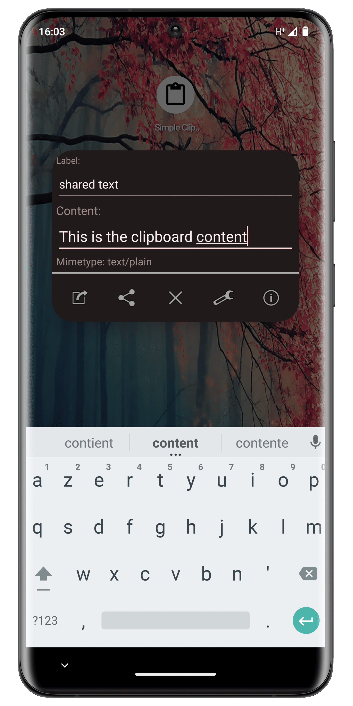
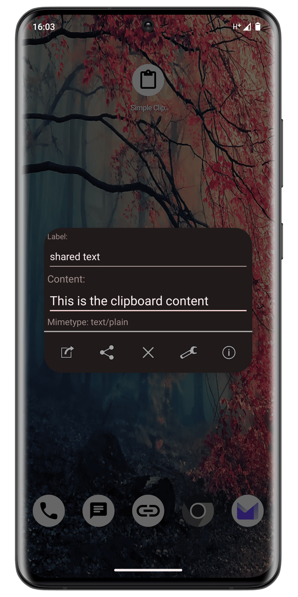
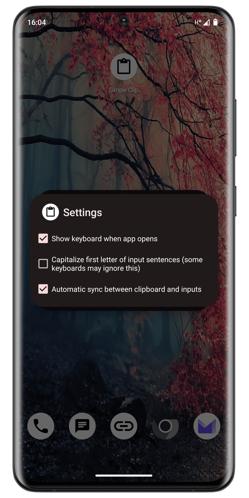
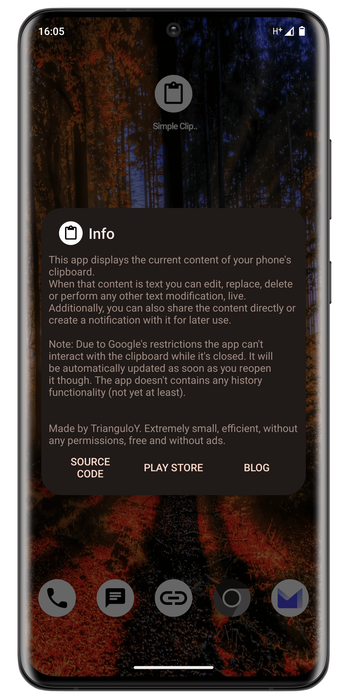
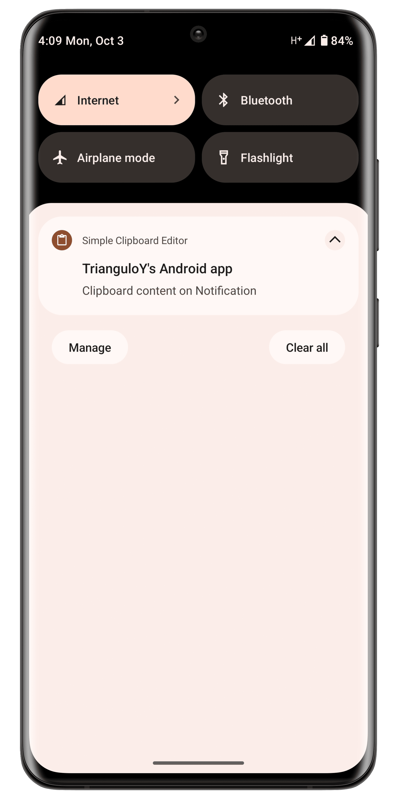

<!-- ---------- Header ---------- -->

# Simple Clipboard Editor
### Android app made by [TrianguloY](https://github.com/TrianguloY)

<!-- ---------- Download ---------- -->

<!-- --Not yet ready for public use:--
 -->

<!-- ---------- Description ---------- -->

**Simple Clipboard Editor** displays the current content of your phone's clipboard. \
When that content is text, you can edit, replace, delete
or perform any other text modification directly. \
Additionally, you can also share the content or create notification with it for later use.

<!-- ---------- Screenshots ---------- -->

 
 
 
 

<!-- ---------- Contribution ---------- -->
## Contribution

**All help is greatly welcomed!**  
Feel free to **suggest changes**, create [**issues**](https://github.com/TrianguloY/SimpleClipboardEditor/issues/new) or even [**pull request**](https://help.github.com/articles/about-pull-requests/). 

**Translations are also greatly appreciated.**

<!-- ---------- License ---------- -->

## License

You can use parts of this project in your own ones, or upload modified versions of it **AS LONG AS** you credit me.

**How to credit:**

- You must add my nick [**TrianguloY**](https://github.com/TrianguloY/) in an `about` or `acknowledgments` section visible to the user.
- You must add a link to this [**GitHub main page**](https://github.com/TrianguloY/SimpleClipboardEditor) or subpage _(if you used a part of the code or an asset)_ in an `about` or `acknowledgments` section visible to the user.

